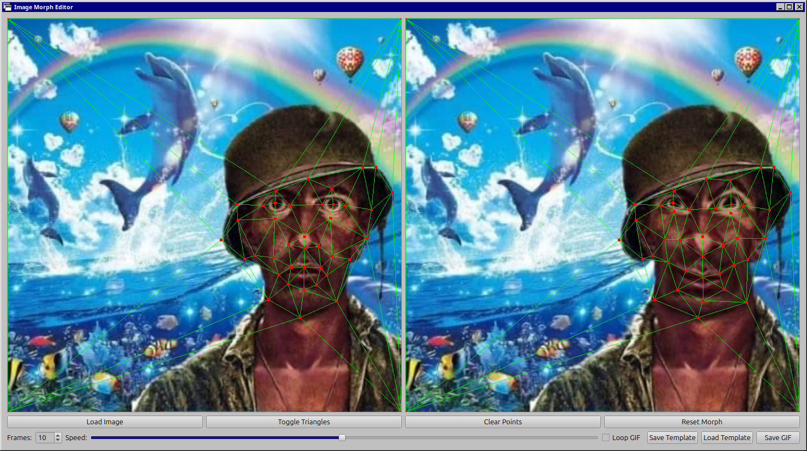

# Image Morpher
A Python-based image morphing application that creates transition animations between two images using triangulation. Built with PySide6 and OpenCV.



## Features

- Interactive point placement and manipulation on source/target images
- Delaunay triangulation for mesh creation
- GIF output of the morphing sequence
- Simple and intuitive UI
- Free and open source alternative to commercial morphing software

## Prerequisites

- Python 3.x

## Installation

1. Clone the repository:
```bash
git clone whatever the link to this shit is

cd image-morpher
```

2. Create and activate a virtual environment:
```bash
python3 -m venv venv
source venv/bin/activate  # On Windows, use: venv\Scripts\activate
```

3. Install required dependencies:
```bash
pip install PySide6 numpy scipy opencv-python imageio pyinstaller
```
see requirements.txt also 
## Usage

1. Run the application:
```bash
python main.py

or python3 if you did not bother setting up a venv or whatever
```

2. Interface controls:
- Left click: Add control points
- Left click and drag: Move existing points
- Right click: Remove points
- Use the UI buttons for loading images, generating morphs, and saving output

## Building from Source

To create a standalone executable:

```bash
pyinstaller --clean --onefile --windowed main.py
```

The executable will be created in the `dist` directory.

## Dependencies

- PySide6: GUI framework
- NumPy: Numerical computations
- SciPy: Delaunay triangulation
- OpenCV: Image processing
- imageio: GIF creation
- PyInstaller: Executable creation

## Known Issues

- Performance may be suboptimal with large images or many control points
- Occasional crashes may occur
- This software was hapharzardly written in one afternoon

## Contributing

Feel free to fork the repository and submit pull requests ( I likely will not merge them or maintain this) . All (downstream) contributions are welcome!

## License

Do whatever the fuck you want with it

## Acknowledgments

Created (out of spite) as a free alternative to commercial morphing software (Morpheus Photo Warper® v3.17 ), with the goal of making image morphing technology accessible for free and ultimately driving Morpheus software out of business forever and ever. 
